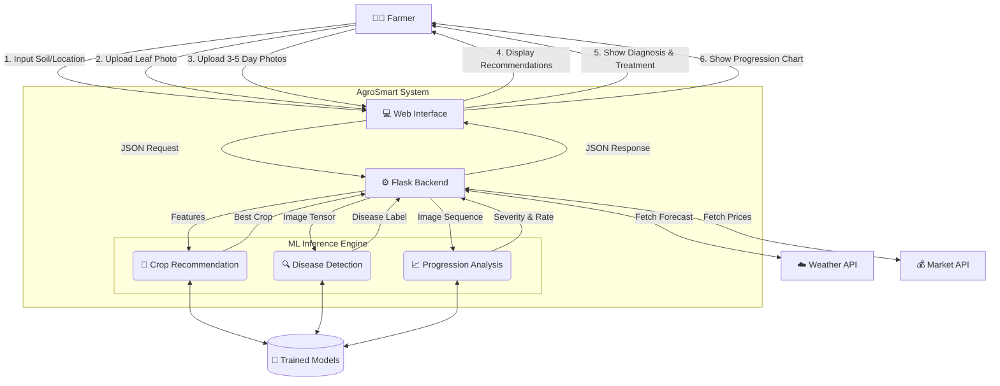

# AgroSmart Project - Data Flow Diagram (DFD)

## 📊 Visual DFD
*(Please refer to the generated `agrosmart_dfd.png` image for the visual representation)*

## 📝 Technical DFD (Mermaid)

Here is the structured data flow logic for the AgroSmart platform:

## 🔄 Process Descriptions

### 1. Crop Recommendation Flow
- **Input**: Nitrogen, Phosphorus, Potassium, pH, Rainfall, Temperature, Humidity.
- **Process**: Gradient Boosting Classifier analyzes soil parameters against trained patterns.
- **Output**: Top 5 recommended crops with confidence percentages.

### 2. Disease Detection Flow
- **Input**: Single leaf image.
- **Process**: MobileNetV3 CNN extracts features and classifies disease type.
- **Output**: Disease name, confidence score, and immediate treatment.

### 3. Disease Progression Flow (New)
- **Input**: Sequence of images (Day 1 to Day 5).
- **Process**: 
    - **CNN (EfficientNet)** extracts spatial features from each frame.
    - **LSTM** analyzes temporal changes across frames.
- **Output**: Severity score (%), Progression rate (speed), and urgency-based recommendations.
